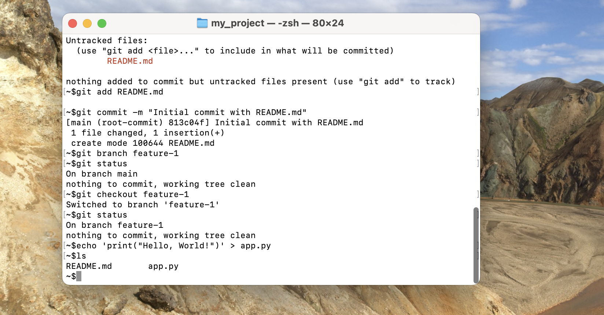

# Git Basic Knowledge Assignment

## Step 1: Setup Git Repository

### Initialize a new Git repository
```bash
mkdir my_project
cd my_project
git init
```
**Explanation:** This initializes a new Git repository in the `my_project` folder. Git will now track changes in this directory.

### Screenshot


### Create a file named `README.md`
```bash
echo "# My Project" > README.md
```
**Explanation:** This command creates a `README.md` file and adds a brief description to it.

### Screenshot


### Stage and commit the `README.md` file
```bash
git add README.md
git commit -m "Initial commit with README.md"
```
**Explanation:** Staging (`git add`) prepares the file to be committed, and committing (`git commit`) saves the snapshot of the file to the repository.

### Screenshot


## Step 2: Making Changes and Version Control

### Create a new branch named `feature-1`
```bash
git branch feature-1
```
**Explanation:** This command creates a new branch called `feature-1`.

### Screenshot


### Switch to the `feature-1` branch
```bash
git checkout feature-1
```
**Explanation:** This switches the current working branch to `feature-1`.

### Screenshot


### Add a new file named `app.py`
```python
# app.py
print("Hello, World!")
```
```bash
echo 'print("Hello, World!")' > app.py
git add app.py
git commit -m "Add app.py with Hello, World! script"
```
**Explanation:** This creates a new Python file, stages it, and commits it to the `feature-1` branch.

### Screenshot


### Modify the `app.py` file
```python
# app.py
def print_name():
    print("Your Name")

print("Hello, World!")
print_name()
```
```bash
echo 'def print_name():\n    print("Your Name")\n\nprint("Hello, World!")\nprint_name()' > app.py
git add app.py
git commit -m "Add function to print name"
```
**Explanation:** This modifies the `app.py` file, stages the changes, and commits them to the `feature-1` branch.

### Screenshot


## Step 3: Merging Branches

### Switch back to the main branch
```bash
git checkout main
```
**Explanation:** This switches the working branch back to `main`.

### Screenshot


### Merge the `feature-1` branch into the main branch
```bash
git merge feature-1
```
**Explanation:** This merges the changes from `feature-1` into `main`. Resolve any conflicts if they arise.

### Screenshot

## Step 4: Using GitHub

### Create a new repository on GitHub named `my_project`
- Go to GitHub, create a new repository named `my_project`.

### Screenshot


### Push the local `my_project` repository to GitHub
```bash
git remote add origin https://github.com/yourusername/my_project.git
git push -u origin main
```
**Explanation:** This sets the remote repository and pushes the local repository to GitHub.

### Screenshot


### Ensure both `main` and `feature-1` branches are available on the remote repository
```bash
git push origin feature-1
```
**Explanation:** This pushes the `feature-1` branch to GitHub.

### Screenshot


## Step 5: Collaboration Simulation

### Create another branch named `bugfix-1`
```bash
git branch bugfix-1
git checkout bugfix-1
```
**Explanation:** Creates and switches to the `bugfix-1` branch.

### Screenshot


### Simulate a bug fix
```python
# Corrected typo in the function name
def print_name():
    print("Your Corrected Name")
```
```bash
echo 'def print_name():\n    print("Your Corrected Name")\n\nprint("Hello, World!")\nprint_name()' > app.py
git add app.py
git commit -m "Fix typo in print_name function"
```
**Explanation:** This corrects a typo, stages the changes, and commits them.

### Screenshot


### Push the `bugfix-1` branch to the remote repository
```bash
git push origin bugfix-1
```
**Explanation:** This pushes the `bugfix-1` branch to GitHub.

### Screenshot


### Open a pull request on GitHub to merge `bugfix-1` into `main`
- Go to GitHub, open a pull request from `bugfix-1` to `main`.

### Screenshot


### Complete the pull request
- Merge the pull request on GitHub.

### Screenshot


## Step 6: History and Reversion

### Viewing the Commit History
```bash
git log
```
**Explanation:** The `git log` command shows a list of commits in the current branch, with each commit's unique hash, author, date, and commit message. This helps you review the history of changes in your project.

### Screenshot


### Reverting the Last Commit
```bash
git checkout main
git revert HEAD
```
**Explanation:** The `git revert HEAD` command creates a new commit that undoes the changes introduced by the most recent commit (`HEAD`). This is useful if you realize that the last commit introduced a mistake or an unwanted change.

### Screenshot


### Undoing the Revert
```bash
git reset --hard HEAD~1
```
**Explanation:** The `git reset --hard HEAD~1` command moves the current branch pointer and the working directory to the previous commit, effectively removing the revert commit and restoring the project to its state before the revert.

### Screenshot


### Issues Encountered

- No significant issues were encountered during this step.
- The commands executed successfully, and the changes were reflected as expected.


### Instructions:
1. Replace the placeholder `path_to_*_screenshot` with the actual paths to your screenshots.
2. Ensure all explanations and screenshots are correctly added.
3. Save and commit your `Git_Assignment_Report.md` file.
4. Push the changes to your GitHub repository.
